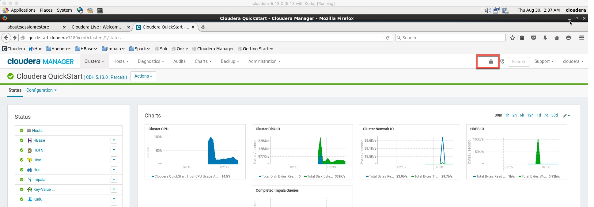
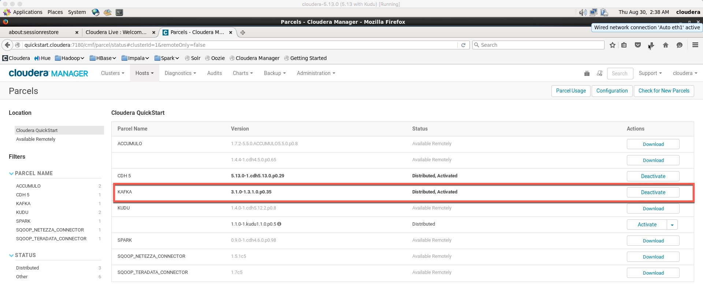
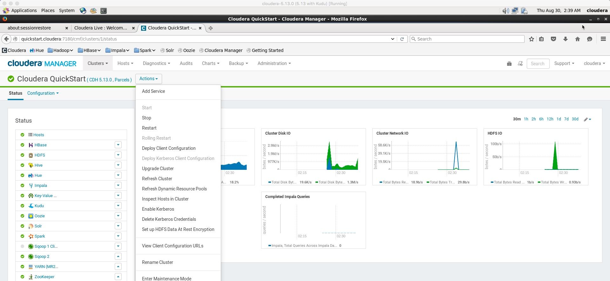
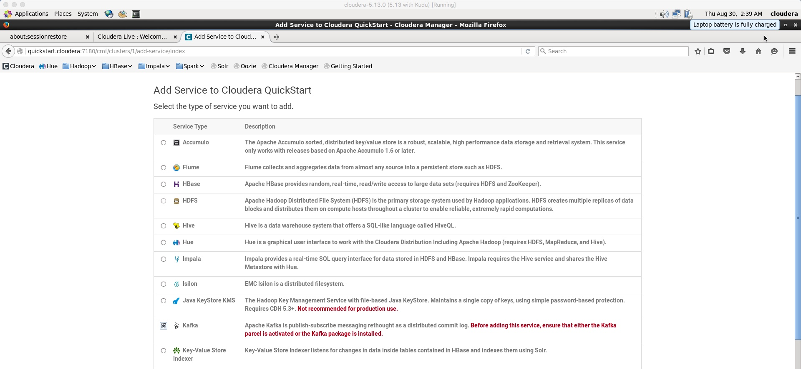
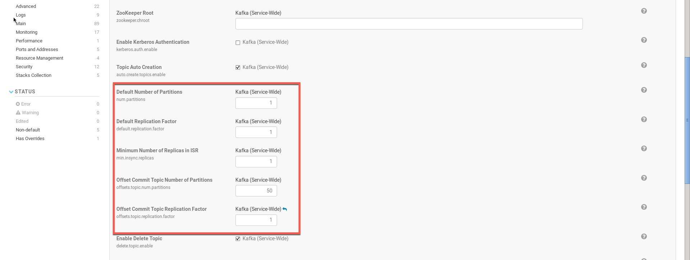

### Kafka Labs

Kafka Installation:

Kafka is not installed by default in the Quickstart VM. Hence we would need to install this manually. 

* After starting the VM, check that all services have been successfully started up

* Check that the Kafka Parcel location is correctly setup

* Add the Kafka Service to the Cluster

* Configure ONLY the Kafka Broker. Leave other settings as default. Click continue

* Change the Replication Factor and Default No of Partitions, since we are running a single node cluster

* Change the Data Directory to <code>/var/local/kafka/data</code>

* Change the heap size to <code>256 MiB</code>. This can also be done after configuration, before starting Kafka. Kafka may fail to start if this is not setup as a minimum of 256 MiB

* Your Kafka configuration is complete. Start Kafka from Cloudera Manager

#### Updates to VM after Kafka Installation

* Update path variable to make the commands a bit easier to manage. Check where kafka is installed by executing a simple search on one of the scrits 

`$ sudo find / -name kafka-topics.sh  
/opt/cloudera/parcels/KAFKA-3.1.0-1.3.1.0.p0.35/lib/kafka/bin/kafka-topics.sh`

* Let's setup this location in the path to make the access easier
`$ export PATH=$PATH:/opt/cloudera/parcels/KAFKA-3.1.0-1.3.1.0.p0.35/lib/kafka/bin`

**TIP**: Put the path in the `~/.bash_profile`file so that you don't have to set up the path everytime. 

#### Creation of Kafka Topic

* Let's create a kafka topic 'test' with a single partition and only one replica

`kafka-topics.sh --create --zookeeper quickstart.cloudera:2181 --replication-factor 1 --partitions 1 --topic test`

#### List existing topics

* Let's list down existing kafka topics
`kafka-topics.sh --list --zookeeper quickstart.cloudera:2181`

#### Sending messages to Kafka Broker

* Kafka comes with a command line client that will take input from a file or from standard input and send it out as messages to the Kafka cluster. By default, each line will be sent as a separate message.

* Run the producer and then type a few messages into the console to send to the server.

`kafka-console-producer.sh --broker-list quickstart.cloudera:9092 --topic test`
`This is first message`	  
`This is second message`

#### Checking messages in Kafka Consumer

* Kafka also has a command line consumer that will dump out messages to output. To see the messages, keep the previous window open and start a Kafka Consumer in a new terminal window. 

`kafka-console-consumer.sh --bootstrap-server quickstart.cloudera:9092 --topic test --from-beginning`
`This is first message`   
`This is second message`

* If you have each of the above commands running in a different terminal then you should now be able to type messages into the producer terminal and see them appear in the consumer terminal.

#### Mini Assignment
In the previous example, we have tested sending messages using the command console, but in reality it would either be a streaming application/files etc. that would be seeding data to Kafka. In this mini assignment, we would be looking at using the Kakfa Connect, which is a tool included with Kafka that imports and exports data to Kafka. It is an extensible tool that runs connectors, which implement the custom logic for interacting with an external system. 
In the mini-assignment, you will:

* Create a text file with some seed data
* **[Hint]** Use the configuration files 
	- connect-standalone.sh
	- connect-standalone.properties
	- connect-file-source.properties
	- connect-file-sink.properties
* Use the Consumer to check that the messages have been loaded in Kafka

#### Reference and Notes
* https://kafka.apache.org
* https://www.tutorialkart.com/apache-kafka/apache-kafka-connector/

